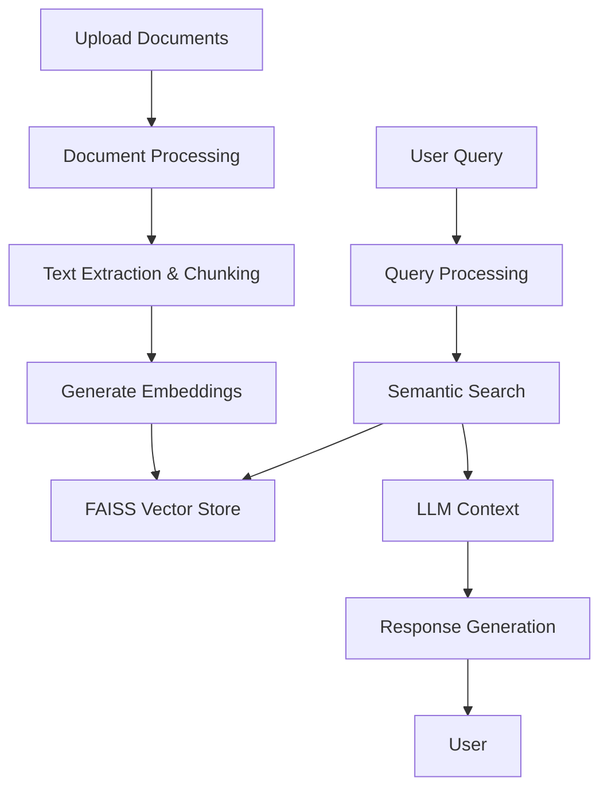

#  📄PolicyMindAI
[](https://opensource.org/licenses/MIT)
[](https://www.python.org/downloads/)
[](https://streamlit.io/)
[](https://streamlit.io/cloud)

<div align="center">
 
  <h2> AI-Powered Insurance Policy Analysis</h2>
  <p>Extract insights, check coverage, and understand complex insurance policies with natural language queries.</p>
</div>

## ✨ Features

| Feature | Description |
|---------|-------------|
| 🔍 **Multi-Model Support** | Choose from Groq, Ollama, or Google Gemini LLMs |
| 📄 **Advanced PDF Processing** | Extract text and tables from insurance policies |
| 💬 **Interactive Chat** | Get instant answers to your insurance policy questions |
| 🔗 **Source Tracking** | See exactly which document and page your answer came from |
| 🚀 **Fast & Efficient** | Optimized for quick responses with large documents |
| 🛡️ **Privacy-Focused** | Process documents locally with optional cloud LLMs |

## 🛠️ Prerequisites

### For Local Development
- 🐍 Python 3.9 or higher
- 📦 pip (Python package manager)
- 🖥️ For Ollama: [Install Ollama](https://ollama.ai/) and keep it running locally
- 🔑 API keys for Groq and/or Google Gemini (if using those providers)

### For Streamlit Cloud Deployment
- 📂 A GitHub account
- 🚀 A [Streamlit Cloud](https://streamlit.io/cloud) account
- 🔑 API keys for your preferred LLM provider (Groq, Google Gemini, etc.)
- ⚙️ Basic understanding of environment variables

## 🚀 Quick Start

### Local Development

1. **Clone the repository**
   ```bash
   git clone https://github.com/yourusername/PolicyMind.git
   cd PolicyMind
   ```

2. **Set up a virtual environment** (recommended)
   ```bash
   # Create and activate virtual environment
   python -m venv venv
   source venv/bin/activate  # On Windows: venv\Scripts\activate
   ```

3. **Install dependencies**
   ```bash
   pip install -r requirements.txt
   ```

### Streamlit Cloud Deployment

1. **Fork this repository** to your GitHub account

2. **Create a new app** on [Streamlit Cloud](https://share.streamlit.io/)

3. **Configure the app** with these settings:
   - Repository: `yourusername/PolicyMind`
   - Branch: `main`
   - Main file path: `app.py`

4. **Set environment variables** in Streamlit Cloud:
   - `GOOGLE_API_KEY`: Your Google Gemini API key (if using Gemini)
   - `GROQ_API_KEY`: Your Groq API key (if using Groq)
   - `OLLAMA_API_BASE`: `http://host.docker.internal:11434` (if using local Ollama)

5. **Deploy!** 🚀

   > **Note for FAISS Storage**: 
   > - Streamlit Cloud provides ephemeral storage, so FAISS indices will be recreated on each deployment
   > - For persistent storage, consider mounting a volume or using a cloud storage solution
   > - The app will automatically recreate the FAISS index from your documents on startup

## 🚀 Deployment with FAISS Storage

### Local FAISS Storage

PolicyMind uses FAISS (Facebook AI Similarity Search) for efficient vector storage and retrieval. Here's how it works:

1. **Index Creation**:
   - Documents are processed and split into chunks
   - Each chunk is converted to embeddings using the selected model
   - Embeddings are stored in a FAISS index for fast similarity search

2. **Persistence**:
   - FAISS indices are saved locally in the `indices` directory
   - Each document collection gets a unique index based on its content hash
   - The app automatically detects and loads existing indices

3. **Streamlit Cloud Considerations**:
   - By default, FAISS indices will be recreated on each deployment
   - For persistent storage, you can:
     - Mount a persistent volume (if using Streamlit Enterprise)
     - Use cloud storage (S3, GCS) with a custom storage adapter
     - Cache indices in Streamlit's session state for the duration of the session

## 🏃‍♂️ Running the Application

1. **Launch the application**
   ```bash
   streamlit run app.py
   ```

2. **Access the web interface**
   - Open your browser to `http://localhost:8501`
   - The app will guide you through the setup process

3. **Start analyzing policies**
   - Upload your insurance policy PDFs
   - Ask questions in natural language
   - Get instant, accurate answers with source references

## 🏗️ System Architecture

PolicyMind is built with a modular, extensible architecture that separates concerns and makes it easy to maintain and extend:

### Core Components

1. **Document Processing Pipeline**
   - Handles multiple document formats (PDF, DOCX, TXT, CSV, XLSX)
   - Advanced table extraction and text normalization
   - Chunking and metadata enrichment

2. **Vector Store (FAISS)**
   - Local, efficient storage of document embeddings
   - Fast similarity search for relevant content
   - Persistent storage of document indices

3. **Query Engine**
   - Processes natural language queries
   - Retrieves relevant document chunks
   - Generates contextual responses with source attribution

4. **Model Management**
   - Supports multiple LLM providers (Groq, Ollama, Google Gemini)
   - Flexible embedding model selection
   - API key management

### Data Flow



## ⚙️ Configuration

Create a `.env` file in the project root with your API keys:

```env
# Groq API Key (https://console.groq.com/keys)
GROQ_API_KEY=your_groq_api_key_here

# Google Gemini API Key (https://aistudio.google.com/app/apikey)
GOOGLE_API_KEY=your_google_api_key_here

# Ollama Configuration (optional)
OLLAMA_BASE_URL=http://localhost:11434  # Default Ollama URL
```

## 🤖 Supported Models

### 🚀 Groq (Cloud)
- `llama3-70b-8192` - Most capable model for complex queries
- `gemma2-9b-it` - Balanced performance and speed
- `llama-3.1-8b-instant` - Fastest response times

### 🖥️ Ollama (Local)
- `llama3` - Meta's latest open-weight model
- `mistral` - High-performance 7B model
- `gemma` - Google's lightweight model

### 🌐 Google Gemini (Cloud)
- `gemini-1.5-pro-latest` - Latest version with extended capabilities
- `gemini-1.5-flash-latest` - Fast and efficient
- `gemini-1.0-pro-latest` - Original production model

## 🛠️ Troubleshooting

### Common Issues

1. **Document Processing Errors**
   - Ensure PDFs are not password protected
   - Check that the file is not corrupted
   - Try with a simpler PDF to test

2. **Model Connection Issues**
   - Verify your API keys are correct
   - Check your internet connection
   - For Ollama, ensure the service is running locally

3. **Performance Optimization**
   - Reduce chunk size for faster processing
   - Use smaller models for faster responses
   - Close other resource-intensive applications

## 📄 License

This project is licensed under the MIT License - see the [LICENSE](LICENSE) file for details.

## 🤝 Contributing

Contributions are welcome! Please feel free to submit a Pull Request.

## 📧 Contact

For support or questions, please open an issue on GitHub.
- Customize retrieval parameters
- Modify the prompt templates

### Adding New Document Types

To support additional document types, extend the `DocumentLoader` class in `rag/document_loader.py`.

## 🐛 Troubleshooting

| Issue | Solution |
|-------|----------|
| ❌ Document processing fails | Ensure PDFs have selectable text (not scanned images) |
| 🔌 Model connection issues | Verify API keys and internet connection |
| 🐢 Slow performance | Use a more powerful model or enable GPU acceleration |
| 📄 Missing text in output | Check if the document text was extracted properly |

## 📚 Example Queries

- "What is the sum insured for this policy?"
- "Is knee surgery covered under this plan?"
- "What are the exclusions in this policy?"
- "Show me the waiting period for pre-existing conditions"

## 🤝 Contributing

Contributions are welcome! Please feel free to submit a Pull Request.

1. Fork the repository
2. Create your feature branch (`git checkout -b feature/AmazingFeature`)
3. Commit your changes (`git commit -m 'Add some AmazingFeature'`)
4. Push to the branch (`git push origin feature/AmazingFeature`)
5. Open a Pull Request

## 📄 License

This project is licensed under the MIT License - see the [LICENSE](LICENSE) file for details.

## 🙏 Acknowledgments

- [Streamlit](https://streamlit.io/) for the amazing web framework
- [LangChain](https://python.langchain.com/) for the RAG implementation
- [Hugging Face](https://huggingface.co/) for the embedding models

---

<div align="center">
  Made with ❤️ by Your Name | <a href="https://github.com/yourusername/PolicyMind">GitHub</a>
</div>
